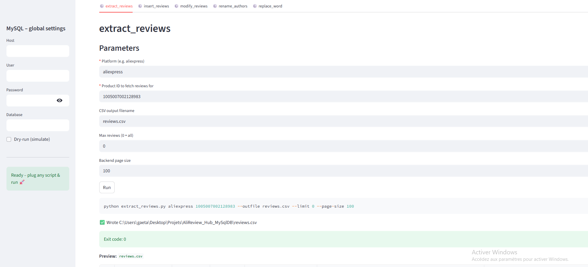

### ✅ Suggestions

1. **Fix nested code blocks**:

   * You opened a Markdown code block with \`\`\`markdown and then used triple backticks again inside (causing rendering issues).
   * Use either raw indentation or consistent backtick layers.

2. **Remove backslashes** in paths:

   * You wrote `extract\_reviews.py` instead of `extract_reviews.py` — the backslash is unnecessary and breaks the display.

---

### ✅ Final corrected version:

```markdown
# 🧰 AliReview Hub – Universal Review Scraper & WordPress Importer



---

## 🧭 Overview

**AliReview Hub** is a universal toolset to:
- ✅ Scrape product reviews from AliExpress (more platforms soon)
- ✅ Clean, anonymize or rename reviewers
- ✅ Inject the data directly into your WordPress database
- ✅ All from an intuitive [Streamlit](https://streamlit.io/) dashboard — no CLI needed

Every operation is modularized via Python scripts, each exposed in the UI via autodetection.

---

## 📁 Folder structure

```

ALIREVIEW\_HUB/
├── img/                     # Screenshot or branding
│   └── img.png
├── scripts/                 # All backend tools (auto-detected by the dashboard)
│   ├── extract\_reviews.py
│   ├── insert\_reviews.py
│   ├── modify\_reviews.py
│   ├── rename\_authors.py
│   └── replace\_word.py
├── streamlit\_app.py         # ⇨ the dashboard
├── requirements.txt
└── README.md

````

---

## 🚀 Getting started

### 1. 📦 Install dependencies

```bash
pip install -r requirements.txt
````

### 2. ▶ Launch the app

```bash
streamlit run streamlit_app.py
```

### 3. 🔌 Plug in your scripts

Any Python file dropped into the `scripts/` folder is automatically loaded into the UI, with its parameters mapped to interactive form fields.

---

## ✨ Key Features

| Module               | Purpose                                                            |
| -------------------- | ------------------------------------------------------------------ |
| `extract_reviews.py` | Scrape reviews from AliExpress → CSV                               |
| `insert_reviews.py`  | Import CSV reviews into WordPress `wp_comments` / `wp_commentmeta` |
| `modify_reviews.py`  | Rename authors for reviews below a given threshold (e.g. < 4★)     |
| `rename_authors.py`  | Mass-replace generic names like “AliExpress Shopper”               |
| `replace_word.py`    | Replace words in review content (e.g. "aliexpress" → "YourBrand")  |

🛠 Each script uses `argparse` and exposes a `cli()` function.
🔁 Streamlit automatically maps arguments → form fields (required vs optional).

---

## 🛡 MySQL Integration

Fill in your database settings once (in the sidebar) — they’ll be reused across all tools that accept `--host`, `--user`, `--password`, `--db`, etc.

Supports:

* ✅ Any WP table prefix (`--prefix`)
* ✅ Custom meta keys (`--rating-key`, `--verified-key`, etc.)
* ✅ Dry-run mode to preview before writing

---

## ✅ Requirements

```txt
streamlit
pymysql
httpx
faker
pandas
```

Already included in [`requirements.txt`](requirements.txt)

---

## 📸 UI Preview


---

## 📌 To-do / Suggestions

* [ ] Add backend for Temu / Amazon
* [ ] Add cron scheduler
* [ ] Export to JSON or SQLite
* [ ] Toggle visibility for advanced parameters
* [ ] Optional login/auth for dashboard

---

## 🤝 Contributions

You're welcome to fork, improve or extend the scripts.
Make sure any new tool supports `cli(parser)` so it's auto-integrated.

---

## 📄 License

MIT – use freely, modify boldly 🚀
